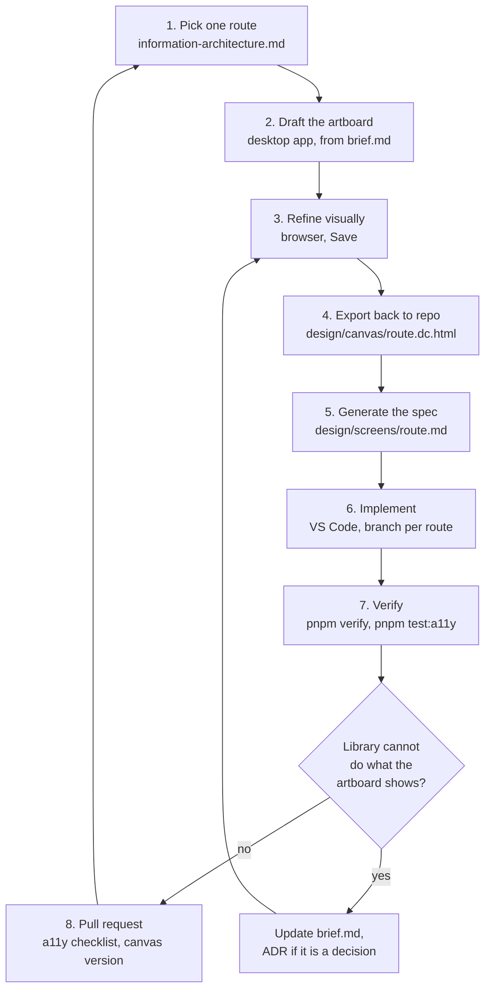

# Workflow: Claude Design and Claude Code, step by step

This is the operating manual for the loop described in `README.md`. It assumes you have not run
this kind of process before, so it names every crossing between the two tools explicitly.

## The one thing to internalise first

**The two tools never talk to each other.** There is no sync, no plugin, no live link. Everything
crosses through two places, and both crossings are deliberate acts you trigger:

1. The **repository**, for text: the brief, the inventory, the tokens, the screen specs.
2. The **published canvas URL**, for pictures: the artboards, editable in a browser.

Anything that is not in one of those two places does not exist as far as the other tool is
concerned. A decision made only in a chat message is lost.

## Who owns what

| Thing                              | Owner                    | Lives in                                           |
| ---------------------------------- | ------------------------ | -------------------------------------------------- |
| Available components               | code                     | `design/component-exports.generated.md`, generated |
| Colour, spacing, type              | code                     | `src/styles/tokens.css`, enforced by CI            |
| Routes and content model           | product plus design      | `design/information-architecture.md`               |
| Rules the design must obey         | code                     | `design/brief.md`, `design/component-inventory.md` |
| Layout, hierarchy, visual language | design                   | the canvas, mirrored in `design/canvas/*.dc.html`  |
| The implementation contract        | design, consumed by code | `design/screens/<route>.md`                        |
| Working software                   | code                     | `src/**`                                           |

## Which surface for which task

- **Claude in the desktop app (this surface).** Best for creating and reviewing the canvas,
  because artboards render here. Also fine for repo work through the connected folder.
- **Claude Code in VS Code.** Best for implementation: it edits files, runs `pnpm verify`, runs the
  Playwright suite, and stays in the terminal where the output is.
- **A browser.** Where you actually edit the canvas by hand: click an element, change it in the
  properties panel, edit text inline, Save.

Both Claude surfaces read the same repository, so neither needs to be told what was decided: the
files say it. That is the whole reason for the contract.

## Phase 0: once per project

1. `git push` so the remote has the contract.
2. `pnpm install`, then `pnpm verify` to confirm the gate is green.
3. Complete the Next.js migration (`../docs/migration-to-nextjs.md`). Do this before implementing
   the first screen, not after.
4. Create the canvas (Phase 1 below) and paste its URL into `README.md` under `Canvas URL`.
   Commit that line. From then on any session can find the canvas.

## Phase 1: create the canvas, once

In the desktop app, in a session with this folder connected:

> Create a design canvas for the Copernicus public site. Read `design/brief.md`,
> `design/component-inventory.md`, `design/component-exports.generated.md` and
> `src/styles/tokens.css` first, and follow them. Start with two artboards only:
> `/wazne-telefony` and the site header, at 360 px and 1280 px. Annotate every block with the
> React Aria component it maps to, or `plain HTML`, and use token names instead of colour values.

Two artboards, not nine. The first canvas is where you discover whether the visual language works;
discovering that across nine screens means redoing nine screens.

You get a published page with its own URL. Open it, look at it, then copy the URL into
`design/README.md` and commit.

## Phase 2: the per-screen loop

Run this loop once per route, in the order given in `brief.md`. One route at a time, all the way
to merged code, before starting the next. The temptation to design everything first is the single
most expensive mistake available here.



### Step 1: pick one route and settle its content

Open `information-architecture.md`, take the next route, and answer three questions in writing
before any pixels exist: what is the visitor here to do, what content does the page hold, what is
the one thing that must be visible without scrolling. Put the answers in the prompt for step 2.

### Step 2: draft the artboard

In the desktop app:

> Add an artboard for `/oddzialy/[slug]` to the canvas at <URL>. Follow `design/brief.md`. The
> visitor is a patient preparing for admission: visiting hours, what to bring and the department
> phone number must be reachable without scrolling on 360 px. Show the server-rendered state and
> the enhanced state where they differ. Annotate every block with its React Aria component.

Claude drafts the artboard as `.dc.html` and republishes the canvas.

### Step 3: refine it by hand

Open the canvas in a browser. Click elements, adjust, edit text, Save. This is the part where your
judgement matters more than any prompt: spacing, emphasis, what gets cut. Save publishes a new
version of the page.

### Step 4: export the artboard back into the repo

This step exists because of the drift rule. After you save in the browser, the published canvas is
ahead of the repository. Ask Claude, in either surface:

> Read the canvas at <URL> and write the current `/oddzialy/[slug]` artboard to
> `design/canvas/oddzialy-slug.dc.html`. Do not change its content.

Now the repository holds exactly the version the next step will describe. Commit it.

### Step 5: generate the spec

> Generate a handoff spec from `design/canvas/oddzialy-slug.dc.html` into
> `design/screens/oddzialy-slug.md`. Include: layout at 360, 768 and 1280 px; token names for
> every colour, spacing and type value; the React Aria component and props per block; default,
> hover, focus-visible, pressed, disabled, invalid and loading states; empty and error states;
> the server-rendered state versus the enhanced state; the focus order; and the content fields it
> reads from the model in `design/information-architecture.md`.

Read the spec yourself. This is the last point where a misunderstanding is cheap to fix. If the
spec says something you did not intend, the artboard was ambiguous; fix the artboard, not the
spec.

### Step 6: implement, in VS Code

Branch per route, as `CONTRIBUTING.md` describes:

```bash
git switch -c feat/oddzialy-slug
```

Then, in Claude Code:

> Implement `design/screens/oddzialy-slug.md`. Use only components from
> `design/component-exports.generated.md` through wrappers in `src/components`, tokens from
> `src/styles/tokens.css`, and follow the JavaScript-requirement table in
> `design/component-inventory.md`: primary content must be present in the server-rendered HTML.
> Add unit tests for anything with state and extend the Playwright suite for this route.

### Step 7: verify

```bash
pnpm verify
pnpm test:a11y
```

Then the part no tool does for you: tab through the page with the keyboard only, and listen to it
with a screen reader. The matrix in `../docs/accessibility.md` says which ones and how often.

### Step 8: pull request

The template in `.github/pull_request_template.md` carries the accessibility checklist. Add two
lines that are specific to this workflow:

- the canvas version the spec came from
- the AAA gap this screen introduces, copied from the advisory output, or `none`

## When design and code disagree

This will happen, and the handling is what keeps the process honest.

**The library cannot do what the artboard shows.** Do not hand-roll the widget. Record it: an entry
in `component-inventory.md` if it is a constraint, an ADR if it is a decision, then change the
artboard. Cost of doing it properly: an hour. Cost of hand-rolling one interactive widget without
roles and keyboard support: it fails the audit and nobody remembers why the code looks like that.

**The artboard breaks the accessibility floor.** Contrast below the budget, targets under 44 px,
information carried by colour alone. The floor wins. It is in `brief.md` precisely so this is not
a negotiation per screen.

**Implementation found a better layout.** Legitimate, and it happens most often on mobile widths.
Update the artboard afterwards, then re-export it. A canvas that no longer matches shipped code is
worse than no canvas, because the next person trusts it.

**The canvas was edited after the spec was generated.** Regenerate the spec, or explicitly decide
that the code is now the truth and bring the canvas back in line. Never implement from a canvas
that has not been exported into `design/canvas/`.

## Definition of done for one screen

1. `design/canvas/<route>.dc.html` in the repository, matching the published canvas.
2. `design/screens/<route>.md` in the repository.
3. Route implemented, primary content present in server-rendered HTML.
4. `pnpm verify` and `pnpm test:a11y` green.
5. Keyboard pass done; screen reader pass done and named in the PR.
6. PR checklist complete, merged to `main`.

## Two traps that catch everyone the first time

**Copying markup out of the canvas.** The artboards are `.dc.html`: pictures with annotations, not
production code. Pasting their markup into the app bypasses React Aria and the tokens, which
removes the two things this whole setup exists to guarantee. Read the artboard, implement from the
spec.

**Designing the whole site before implementing anything.** The first implemented screen teaches
you more about the component set than five artboards do. Nine finished artboards implemented
afterwards means nine revisions.

## What the first screen costs, honestly

The first route through this loop is slow, because the component states sheet, the theme handling
and the header get built alongside it. Expect most of the first screen's time to go into things
that then serve every later screen. From the third route onward the loop is mostly step 6.
